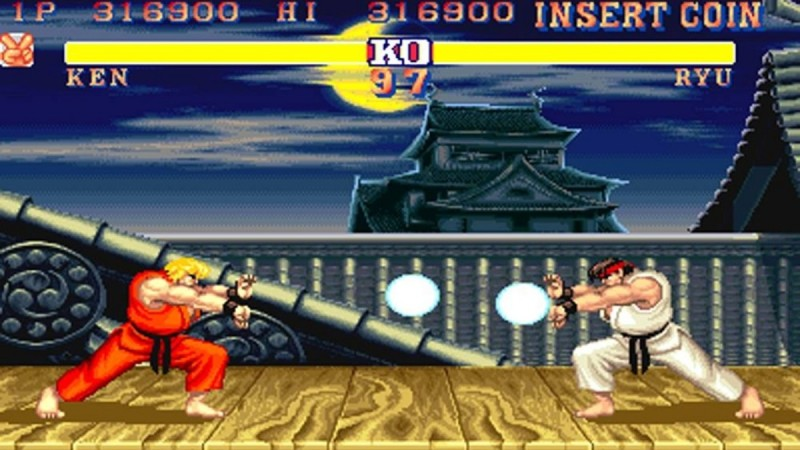

# 2020-Game-Play
Authors: Tanmay Prakash, Maxwell Hampel, Ryan Butler and Shreyas Srinivasan

# Project Description
'''
This project involves the development of a model agent for the old time classic game Street Figher 2. 
We use the Champions Deluxe Edition source code via the Dopamine Framework and the Gym Retro emulator to train our agent.
The basic principle implemented is Reinforcement Learning via pixel-based analysis.

Warning: It is advised to design a state-vector map, but an older game can still have a proper agent using pixel analysis. 

# Video demonstration
Please refer to this video for details and a walkthrough on the project content:
https://youtu.be/FdtwKXfOmLA

# Repository Breakdown
Code:
  The repository is made of four major parts: 

    1. The Data Generator which consists of the batch-wise output of the game's metadata at 30 frames per second.
    2. The Environment and Data Checkers ensure that all the correct packages and correct package versions are in place to generate the model. 
    3. The Model comprises of calls to the Gym_retro.py file and also has code that enables a visual display of your agent training. 
    4. The Game_Playing_Testing.ipynb notebook which contains the code to train and visualize the agent. 

For individual breakdown of the above code, refer to each individual branch on this github which have the appropriate titles. 

# Training Procedure  
To get the training started:
  1. Please open the Game_Playing_Testing.ipynb file to gain access to the notebook. 
     Link: https://github.com/umd-fire-coml/2020-Game-Play/blob/master/Game_Playing_Testing.ipynb
  2. Just run cell by cell from top to bottom in the notebook to create and visualize your agent. 
  
# References
Want to know more about the items used in this project?
  1) https://openai.com/blog/gym-retro/ 
  2) https://opensource.google/projects/dopamine
  3) https://medium.com/@SmartLabAI/reinforcement-learning-algorithms-an-intuitive-overview-904e2dff5bbc
  '''
  

